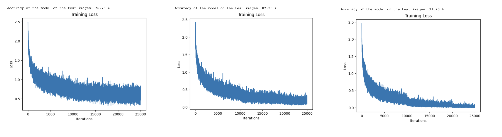
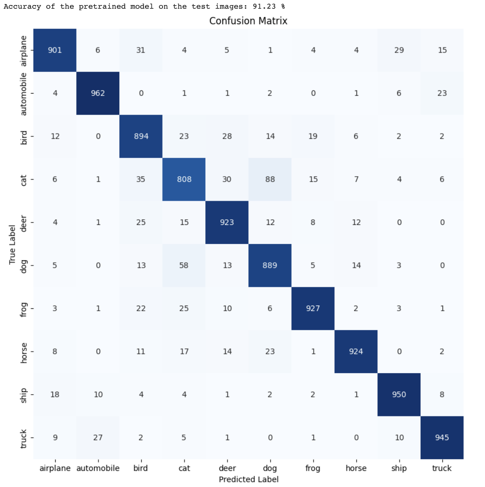

# dl-miniproject

by [Yuchen Liu](yl5680@nyu.edu), [Chenqian Le](cl6707@nyu.edu), [Yuesheng Xu](yx2599@nyu.edu)

In this project, we aimed to design a deep learning model based on the ResNet architecture to classify images from the CIFAR-10 dataset. Our findings indicate that the model achieves a test accuracy of 91\%, with a total of 778,538 parameters in the model. 

## Code

To run the code, simply open the `miniproject.ipynb` file in the `code` folder with Jupyter Notebook.

## Results

We have designed and compared three ResNet models. Loss curves are shown below.

The confusion matrix of the best model

## References

Kaiming He, Xiangyu Zhang, Shaoqing Ren, and Jian Sun. "Deep Residual Learning for Image Recognition." In Proceedings of the IEEE Conference on Computer Vision and Pattern Recognition (CVPR), 2016.

BibTeX:

@inproceedings{he2016deep,
  title={Deep Residual Learning for Image Recognition},
  author={He, Kaiming and Zhang, Xiangyu and Ren, Shaoqing and Sun, Jian},
  booktitle={Proceedings of the IEEE Conference on Computer Vision and Pattern Recognition},
  year={2016}
}

## Acknowledgement

Some code is borrowed from [this website](https://pytorch-tutorial.readthedocs.io/en/latest/tutorial/chapter03_intermediate/3_2_2_cnn_resnet_cifar10/)